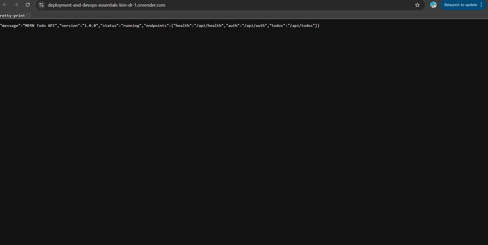
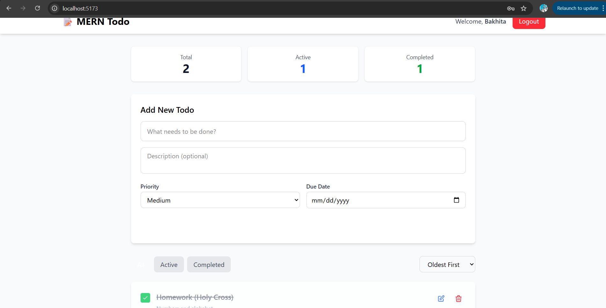

# MERN Todo Application - Full Stack Deployment

A production-ready MERN (MongoDB, Express, React, Node.js) todo application with complete CI/CD pipeline, monitoring, and deployment configurations.

## 🚀 Live Demo

- **Frontend URL**: `https://your-app.vercel.app` (Update after deployment)
- **Backend API**: `https://your-api.onrender.com` (Update after deployment)
- **API Documentation**: `https://your-api.onrender.com/api/health`

## ✨ Features

### Core Functionality
- ✅ User authentication (Register/Login with JWT)
- ✅ Create, Read, Update, Delete todos
- ✅ Mark todos as complete/incomplete
- ✅ Filter todos (All/Active/Completed)
- ✅ Sort todos (Newest/Oldest/Priority)
- ✅ Priority levels (Low/Medium/High)
- ✅ Due dates for todos
- ✅ Responsive design with Tailwind CSS v4

### DevOps & Production Features
- 🔒 Secure authentication with JWT
- 🛡️ Security headers and rate limiting
- 📊 Health check endpoints
- 🐛 Error tracking with Sentry
- 📝 Winston logging
- 🔄 Automatic CI/CD with GitHub Actions
- 🌐 Production-ready deployments
- ⚡ Optimized build and code splitting

## 📁 Project Structure

```
mern-todo-deployment/
├── backend/           # Express.js API server
├── frontend/          # React application
├── .github/workflows/ # CI/CD pipelines
├── deployment/        # Deployment configs
└── monitoring/        # Monitoring setup
```

## 🛠️ Technology Stack

### Frontend
- **React 18** - UI library
- **Vite** - Build tool
- **Tailwind CSS v4** - Styling
- **React Router** - Navigation
- **Axios** - HTTP client
- **Sentry** - Error tracking

### Backend
- **Node.js & Express** - Server
- **MongoDB & Mongoose** - Database
- **JWT** - Authentication
- **Bcrypt** - Password hashing
- **Helmet** - Security headers
- **Winston** - Logging
- **Sentry** - Error tracking

### DevOps
- **GitHub Actions** - CI/CD
- **Render** - Backend hosting
- **Vercel** - Frontend hosting
- **MongoDB Atlas** - Database hosting

## 🚀 Getting Started

### Prerequisites

- Node.js (v18 or higher)
- MongoDB Atlas account
- Git

### Local Development Setup

1. **Clone the repository**
   ```bash
   git clone <your-repo-url>
   cd mern-todo-deployment
   ```

2. **Setup Backend**
   ```bash
   cd backend
   npm install
   cp .env.example .env
   # Edit .env with your MongoDB URI and JWT secret
   npm run dev
   ```

3. **Setup Frontend** (in a new terminal)
   ```bash
   cd frontend
   npm install
   cp .env.example .env
   # Edit .env with your backend URL
   npm run dev
   ```

4. **Access the application**
   - Frontend: http://localhost:5173
   - Backend: http://localhost:5000

### Environment Variables

#### Backend (.env)
```env
NODE_ENV=development
PORT=5000
MONGODB_URI=your_mongodb_connection_string
JWT_SECRET=your_super_secret_jwt_key
JWT_EXPIRE=30d
FRONTEND_URL=http://localhost:5173
SENTRY_DSN=your_sentry_dsn (optional)
LOG_LEVEL=info
```

#### Frontend (.env)
```env
VITE_API_URL=http://localhost:5000/api
VITE_SENTRY_DSN=your_sentry_dsn (optional)
```

## 📦 Deployment Guide

### 1. MongoDB Atlas Setup

1. Create a free account at [MongoDB Atlas](https://www.mongodb.com/cloud/atlas)
2. Create a new cluster
3. Add a database user with read/write permissions
4. Whitelist your IP (or use 0.0.0.0/0 for all IPs)
5. Get your connection string

### 2. Backend Deployment (Render)

1. **Sign up at [Render](https://render.com)**

2. **Create a New Web Service**
   - Connect your GitHub repository
   - Select the backend directory
   - Configure:
     ```
     Name: mern-todo-api
     Environment: Node
     Build Command: cd backend && npm install
     Start Command: cd backend && npm start
     ```

3. **Add Environment Variables**
   ```
   NODE_ENV=production
   MONGODB_URI=<your-mongodb-atlas-uri>
   JWT_SECRET=<generate-a-strong-secret>
   JWT_EXPIRE=30d
   FRONTEND_URL=<your-vercel-url>
   SENTRY_DSN=<optional>
   ```

4. **Deploy**
   - Render will automatically deploy on git push to main

### 3. Frontend Deployment (Vercel)

1. **Sign up at [Vercel](https://vercel.com)**

2. **Import GitHub Repository**
   - Select your repository
   - Configure:
     ```
     Framework Preset: Vite
     Root Directory: frontend
     Build Command: npm run build
     Output Directory: dist
     ```

3. **Add Environment Variables**
   ```
   VITE_API_URL=<your-render-backend-url>/api
   VITE_SENTRY_DSN=<optional>
   ```

4. **Deploy**
   - Vercel will automatically deploy on git push to main

### 4. Enable Auto-Deployment

Both Render and Vercel support automatic deployments:
- Push to `main` branch triggers production deployment
- Push to `develop` branch triggers preview deployment (configure separately)

## 🔄 CI/CD Pipeline

The project includes GitHub Actions workflows:

### Backend CI (`backend-ci.yml`)
- Runs on push/PR to main/develop
- Tests on Node.js 18.x and 20.x
- Runs linter
- Executes tests
- Security audit

### Frontend CI (`frontend-ci.yml`)
- Runs on push/PR to main/develop
- Tests on Node.js 18.x and 20.x
- Runs linter
- Builds application
- Security audit

### Deployment
- `backend-cd.yml` - Triggers on push to main
- `frontend-cd.yml` - Triggers on push to main
- Auto-deploys when CI passes

## 📊 Monitoring & Maintenance

### Health Check Endpoints

- `GET /api/health` - Basic health check
- `GET /api/health/detailed` - Detailed system status
- `GET /api/health/ready` - Readiness probe
- `GET /api/health/live` - Liveness probe

### Error Tracking

1. **Sign up at [Sentry](https://sentry.io)**
2. Create a new project
3. Get your DSN
4. Add to environment variables:
   - Backend: `SENTRY_DSN`
   - Frontend: `VITE_SENTRY_DSN`

### Logging

- Backend uses Winston for structured logging
- Logs are written to `backend/logs/`
- Log levels: error, warn, info, debug

### Maintenance Tasks

1. **Regular Updates**
   ```bash
   npm audit
   npm update
   ```

2. **Database Backups**
   - MongoDB Atlas provides automatic backups
   - Configure backup schedule in Atlas dashboard

3. **Monitoring**
   - Check Render/Vercel dashboards regularly
   - Monitor Sentry for errors
   - Review logs for issues

## 🧪 Testing

### Backend Tests
```bash
cd backend
npm test
npm run lint
```

### Frontend Tests
```bash
cd frontend
npm run lint
npm run build
```

## 📸 Screenshots

### CI/CD Pipeline


### Deployment Status



### Application


## 🔐 Security Features

- JWT-based authentication
- Password hashing with bcrypt
- Rate limiting on API endpoints
- CORS configuration
- Security headers with Helmet
- Input validation
- MongoDB injection prevention

## 🤝 Contributing

1. Fork the repository
2. Create a feature branch
3. Commit your changes
4. Push to the branch
5. Open a Pull Request

## 📝 License

This project is licensed under the MIT License.

## 👨‍💻 Author

Your Name - [GitHub Profile](https://github.com/Kim-dr/Kimberly)

## 🙏 Acknowledgments

- Week 7 DevOps Assignment
- MERN Stack Community
- All open-source contributors

---

**Note**: Remember to update this README with your actual deployment URLs and screenshots after deployment!